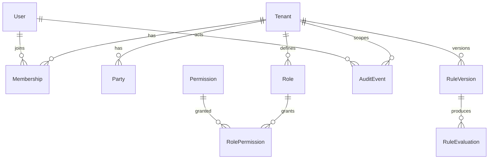

# Modelo de datos (resumen ER)

Fuente de verdad: [`packages/db/prisma/schema.prisma`](../../packages/db/prisma/schema.prisma).

## Núcleo multi-tenant

- **Tenant**: organización cliente de VERIK (`slug` único).
- **User**: credenciales globales (`email` único). `isPlatformSuperAdmin` identifica staff VERIK (sin `Membership` obligatorio).
- **Role**: rol por tenant (`key` único dentro del tenant).
- **Permission**: permiso global (`key` único, p. ej. `parties:read`).
- **RolePermission**: N:N rol ↔ permiso.
- **Membership**: usuario ↔ tenant ↔ rol (un usuario por tenant en el seed demo).

## Dominio cumplimiento (MVP)

- **Party**: cliente/contraparte (`tenantId`, datos de identificación y `riskLevel`).
- **AuditEvent**: registro append-only de acciones (`action`, `resourceType`, `resourceId`, actor, IP/UA, `requestId`).
- **RuleVersion**: definición JSON versionada (`status`: draft | active | retired).
- **RuleEvaluation**: traza de evaluación contra un recurso (extensible a motor async).
- **AdminQueryLog**: invocaciones de la terminal administrativa (allowlist).
- **Consent**: consentimiento Open Finance-ready (propósito, vigencia, `partyId` opcional).

## Relaciones clave

## Seeds

Ver `packages/db/prisma/seed.ts`: tenant `demo`, 6 usuarios de prueba, permisos y roles alineados al plan maestro.
